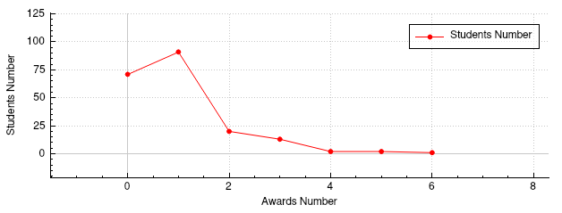
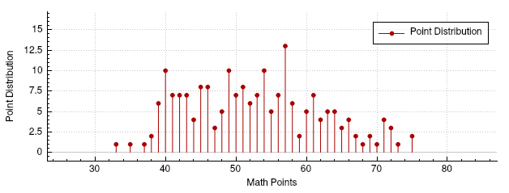

# Awards data set
[Source](https://www.sheffield.ac.uk/mash/statistics/datasets)

---

## Data Set Description

The number of awards earned by students at one high school. Predictors of the number of awards earned include the type of program in which the student was enrolled (e.g., vocational, general or academic) and the score on their final exam in math. This data set is used to show an example of the Poisson Regression. The predicted variable is the number of awards and the predictors are the program type and the Maths score.

| id | num_awards | prog | math |
|---:|--:|--:|---:|
|  1 | 1 | 3 | 40 |
|  2 | 1 | 3 | 33 |
|  3 | 0 | 2 | 48 |
|  4 | 1 | 2 | 41 |
|  5 | 1 | 2 | 43 |
|  6 | 0 | 2 | 46 |
|  7 | 1 | 2 | 59 |
|  8 | 0 | 2 | 52 |
|  9 | 0 | 3 | 52 |
| 10 | 1 | 1 | 49 |
| ... | ... | ... | ... |

Total Rows = 200

| Variable name | Variable | Data type |
| ------------- | ---------| --------- |
| id            | Students | Number    |
| num_awards    | Number of awards | Scale |
| prog | Program type | Nominal |
| math | Maths Score | Scale |

prog Field Classes:
- 1 = Vocational
- 2 = General
- 3 = Academic

---

## Group by Education Programm and count Students and their Awards

```sql
SELECT
    CASE prog
        WHEN 1 THEN 'Vocational'
        WHEN 2 THEN 'General'
        WHEN 3 THEN 'Academic'
    END AS 'Education Program',
    COUNT(id) AS 'Students Number',
    SUM(num_awards) AS 'Total Awards'
FROM Awards
GROUP BY prog
```

| Education Program | Students Number | Total Awards |
|-------------------|----------------:|-------------:|
| Vocational        |              45 |           26 |
| General           |             105 |          123 |
| Academic          |              50 |           45 |

---

## Awards Count for Students and Education Program

```sql
SELECT
    COUNT(*) AS 'Students Number',
    CASE prog
        WHEN 1 THEN 'Vocational'
        WHEN 2 THEN 'General'
        WHEN 3 THEN 'Academic'
    END AS 'Education Program',
    num_awards AS 'Awards Number'
FROM Awards
GROUP BY num_awards, prog
ORDER BY num_awards DESC
```
| Students Number | Education Program | Awards Number |
|---:|------------|--:|
|  1 | General    | 6 |
|  2 | General    | 5 |
|  2 | General    | 4 |
|  2 | Vocational | 3 |
| 10 | General    | 3 |
|  1 | Academic   | 3 |
|  2 | Vocational | 2 |
| 12 | General    | 2 |
|  6 | Academic   | 2 |
| 16 | Vocational | 1 |
| 45 | General    | 1 |
| 30 | Academic   | 1 |
| 25 | Vocational | 0 |
| 33 | General    | 0 |
| 13 | Academic   | 0 |

---

## Select Top 10 Students by Awards overall

```sql
SELECT
    id AS 'ID',
    CASE prog
        WHEN 1 THEN 'Vocational'
        WHEN 2 THEN 'General'
        WHEN 3 THEN 'Academic'
    END AS 'Education Program',
    num_awards AS 'Awards'
FROM Awards
ORDER BY num_awards DESC
LIMIT 10
```

| ID  | Education Program| Awards |
|----:|------------|--:|
| 194 | General    | 6 |
|  95 | General    | 5 |
|  96 | General    | 5 |
|  26 | General    | 4 |
| 136 | General    | 4 |
|  23 | General    | 3 |
|  34 | General    | 3 |
|  38 | General    | 3 |
|  72 | Academic   | 3 |
|  85 | Vocational | 3 |

---

## Awards Count for Students

```sql
SELECT
    COUNT(*) AS 'Students Number',
    num_awards AS 'Awards Number'
FROM Awards
GROUP BY num_awards
```



| Students Number | Awards Number |
|---:|--:|
| 71 | 0 |
| 91 | 1 |
| 20 | 2 |
| 13 | 3 |
|  2 | 4 |
|  2 | 5 |
|  1 | 6 |

---

## Summary of Math Points

```sql
SELECT
    AVG(math) AS 'Mean'
FROM Awards
```

```sql
SELECT
    math AS 'Median'
FROM Awards
ORDER BY math
LIMIT 1 
OFFSET (SELECT COUNT(*) FROM Awards) / 2
```

```sql
SELECT
    math AS 'Mode',
    COUNT(*) AS 'Count'
FROM Awards
GROUP BY math
ORDER BY COUNT(*) DESC
LIMIT 1
```

```sql
SELECT 
    MIN(math) AS 'Max',
    MAX(math) AS 'Min',
    MAX(math) - MIN(math) AS 'Range'
FROM Awards
```

- Mean = 52.645
- Median = 52
- Mode = 57 - 13
- Min = 33
- Max = 75
- Range = 42

### Math Points Distribution

```sql
SELECT 
    math AS 'Math Points',
    COUNT(*) AS 'Point Distribution'
FROM Awards
GROUP BY math
ORDER BY math ASC
```



| Math Points | Point Distribution |
|-------------|--------------------|
|          33 |                  1 |
|          35 |                  1 |
|          37 |                  1 |
|          38 |                  2 |
|          39 |                  6 |
|          40 |                 10 |
|          41 |                  7 |
|          42 |                  7 |
|          43 |                  7 |
|          44 |                  4 |
|          45 |                  8 |
|          46 |                  8 |
|          47 |                  3 |
|          48 |                  5 |
|          49 |                 10 |
|          50 |                  7 |
|          51 |                  8 |
|          52 |                  6 |
|          53 |                  7 |
|          54 |                 10 |
|          55 |                  5 |
|          56 |                  7 |
|          57 |                 13 |
|          58 |                  6 |
|          59 |                  2 |
|          60 |                  5 |
|          61 |                  7 |
|          62 |                  4 |
|          63 |                  5 |
|          64 |                  5 |
|          65 |                  3 |
|          66 |                  4 |
|          67 |                  2 |
|          68 |                  1 |
|          69 |                  2 |
|          70 |                  1 |
|          71 |                  4 |
|          72 |                  3 |
|          73 |                  1 |
|          75 |                  2 |
